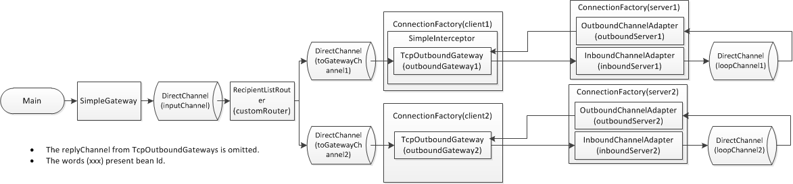

# si_tcp_sample
Tcp Connection Sample with Spring Integration based on [TCP Sample](https://github.com/spring-projects/spring-integration-samples/tree/master/basic/tcp-client-server).




## What is it for?
Comparing TcpConnectionEvents logs published by raw TcpConnection with published by TcpConnection wrapped interceptor.

## How to use
1. Clone this project in your PC
2. Run Main class.
3. Type some characters and press the Enter key. Then, tcp communication will start between the clients and the servers.
4. Exit when you type only 'q' and press the enter key.

## Output example
In this case, typed 'aaa'.
```
aaa
11:58:32.357 [main] DEBUG org.springframework.beans.factory.support.DefaultListableBeanFactory - Returning cached instance of singleton bean 'inputChannel'
11:58:32.358 [main] DEBUG org.springframework.beans.factory.support.DefaultListableBeanFactory - Returning cached instance of singleton bean 'integrationEvaluationContext'
11:58:32.377 [main] DEBUG org.springframework.beans.factory.support.DefaultListableBeanFactory - Returning cached instance of singleton bean 'integrationGlobalProperties'
11:58:32.380 [main] DEBUG org.springframework.integration.channel.DirectChannel - preSend on channel 'inputChannel', message: GenericMessage [payload=aaa, headers={replyChannel=org.springframework.messaging.core.GenericMessagingTemplate$TemporaryReplyChannel@563f38c4, errorChannel=org.springframework.messaging.core.GenericMessagingTemplate$TemporaryReplyChannel@563f38c4, id=03a8d8b7-40ee-1f27-7c1d-1c5e1fa135f2, timestamp=1515553112380}]
11:58:32.380 [main] DEBUG org.springframework.integration.router.RecipientListRouter - org.springframework.integration.config.RouterFactoryBean#0 received message: GenericMessage [payload=aaa, headers={replyChannel=org.springframework.messaging.core.GenericMessagingTemplate$TemporaryReplyChannel@563f38c4, errorChannel=org.springframework.messaging.core.GenericMessagingTemplate$TemporaryReplyChannel@563f38c4, id=03a8d8b7-40ee-1f27-7c1d-1c5e1fa135f2, timestamp=1515553112380}]
11:58:32.380 [main] DEBUG org.springframework.integration.channel.DirectChannel - preSend on channel 'toGatewayChannel1', message: GenericMessage [payload=aaa, headers={replyChannel=org.springframework.messaging.core.GenericMessagingTemplate$TemporaryReplyChannel@563f38c4, errorChannel=org.springframework.messaging.core.GenericMessagingTemplate$TemporaryReplyChannel@563f38c4, id=03a8d8b7-40ee-1f27-7c1d-1c5e1fa135f2, timestamp=1515553112380}]
11:58:32.380 [main] DEBUG org.springframework.integration.ip.tcp.TcpOutboundGateway - org.springframework.integration.ip.tcp.TcpOutboundGateway#0 received message: GenericMessage [payload=aaa, headers={replyChannel=org.springframework.messaging.core.GenericMessagingTemplate$TemporaryReplyChannel@563f38c4, errorChannel=org.springframework.messaging.core.GenericMessagingTemplate$TemporaryReplyChannel@563f38c4, id=03a8d8b7-40ee-1f27-7c1d-1c5e1fa135f2, timestamp=1515553112380}]
11:58:32.380 [main] DEBUG org.springframework.integration.ip.tcp.connection.TcpNetClientConnectionFactory - Opening new socket connection to localhost:50001
11:58:32.396 [main] DEBUG org.springframework.integration.ip.tcp.connection.TcpNetConnection - New connection localhost:50001:58459:aa1f25b0-570e-4631-8477-33a19f1bb6ba
11:58:32.396 [main] DEBUG org.springframework.integration.ip.tcp.connection.TcpNetClientConnectionFactory - client1: Added new connection: localhost:50001:58459:aa1f25b0-570e-4631-8477-33a19f1bb6ba
11:58:32.397 [main] DEBUG org.springframework.beans.factory.support.DefaultListableBeanFactory - Returning cached instance of singleton bean 'tcpConnectionEventsListener'
11:58:32.397 [main] DEBUG com.neriudon.example.tcp.listener.TcpConnectionEventsListener - ★OPEN★ TcpConnectionOpenEvent [source=SimpleInterceptor:null], [factory=unknown, connectionId=localhost:50001:58459:aa1f25b0-570e-4631-8477-33a19f1bb6ba] **OPENED**
11:58:32.401 [main] DEBUG org.springframework.integration.ip.tcp.TcpOutboundGateway - Added pending reply localhost:50001:58459:aa1f25b0-570e-4631-8477-33a19f1bb6ba
11:58:32.401 [main] DEBUG com.neriudon.example.tcp.interceptor.SimpleInterceptor - send message via interceptor
11:58:32.402 [pool-3-thread-1] DEBUG org.springframework.integration.ip.tcp.connection.TcpNetConnection - localhost:50001:58459:aa1f25b0-570e-4631-8477-33a19f1bb6ba Reading...
11:58:32.402 [pool-1-thread-1] DEBUG org.springframework.integration.ip.tcp.connection.TcpNetServerConnectionFactory - Accepted connection from 127.0.0.1
11:58:32.404 [pool-1-thread-1] DEBUG org.springframework.integration.ip.tcp.connection.TcpNetConnection - New connection 127.0.0.1:58459:50001:53e7af0d-3891-45a3-bd86-73ed95f4fe66
11:58:32.404 [pool-1-thread-1] DEBUG org.springframework.integration.ip.tcp.connection.TcpNetServerConnectionFactory - server1: Added new connection: 127.0.0.1:58459:50001:53e7af0d-3891-45a3-bd86-73ed95f4fe66
11:58:32.416 [pool-1-thread-1] DEBUG org.springframework.beans.factory.support.DefaultListableBeanFactory - Returning cached instance of singleton bean 'tcpConnectionEventsListener'
11:58:32.416 [pool-1-thread-1] DEBUG com.neriudon.example.tcp.listener.TcpConnectionEventsListener - ★OPEN★ TcpConnectionOpenEvent [source=TcpNetConnection:127.0.0.1:58459:50001:53e7af0d-3891-45a3-bd86-73ed95f4fe66], [factory=server1, connectionId=127.0.0.1:58459:50001:53e7af0d-3891-45a3-bd86-73ed95f4fe66] **OPENED**
11:58:32.418 [main] DEBUG org.springframework.integration.ip.tcp.connection.TcpNetConnection - localhost:50001:58459:aa1f25b0-570e-4631-8477-33a19f1bb6ba Message sent GenericMessage [payload=aaa, headers={replyChannel=org.springframework.messaging.core.GenericMessagingTemplate$TemporaryReplyChannel@563f38c4, errorChannel=org.springframework.messaging.core.GenericMessagingTemplate$TemporaryReplyChannel@563f38c4, id=03a8d8b7-40ee-1f27-7c1d-1c5e1fa135f2, timestamp=1515553112380}]
11:58:32.420 [pool-3-thread-1] DEBUG org.springframework.integration.ip.tcp.serializer.ByteArrayCrLfSerializer - Available to read: 0
11:58:32.420 [pool-1-thread-2] DEBUG org.springframework.integration.ip.tcp.connection.TcpNetConnection - 127.0.0.1:58459:50001:53e7af0d-3891-45a3-bd86-73ed95f4fe66 Reading...
11:58:32.420 [pool-1-thread-2] DEBUG org.springframework.integration.ip.tcp.serializer.ByteArrayCrLfSerializer - Available to read: 5
11:58:32.420 [pool-1-thread-2] DEBUG org.springframework.beans.factory.support.DefaultListableBeanFactory - Returning cached instance of singleton bean 'messageBuilderFactory'
11:58:32.429 [pool-1-thread-2] DEBUG org.springframework.integration.ip.tcp.connection.TcpNetConnection - Message received GenericMessage [payload=byte[3], headers={ip_tcp_remotePort=58459, ip_connectionId=127.0.0.1:58459:50001:53e7af0d-3891-45a3-bd86-73ed95f4fe66, ip_localInetAddress=/127.0.0.1, ip_address=127.0.0.1, id=f0ede874-9b0a-a783-dfad-00afe29be5b6, ip_hostname=127.0.0.1, timestamp=1515553112429}]
11:58:32.430 [pool-1-thread-2] DEBUG org.springframework.integration.channel.DirectChannel - preSend on channel 'loopChannel1', message: GenericMessage [payload=byte[3], headers={ip_tcp_remotePort=58459, ip_connectionId=127.0.0.1:58459:50001:53e7af0d-3891-45a3-bd86-73ed95f4fe66, ip_localInetAddress=/127.0.0.1, ip_address=127.0.0.1, id=f0ede874-9b0a-a783-dfad-00afe29be5b6, ip_hostname=127.0.0.1, timestamp=1515553112429}]
11:58:32.430 [pool-1-thread-2] DEBUG org.springframework.integration.ip.tcp.TcpSendingMessageHandler - org.springframework.integration.ip.tcp.TcpSendingMessageHandler#0 received message: GenericMessage [payload=byte[3], headers={ip_tcp_remotePort=58459, ip_connectionId=127.0.0.1:58459:50001:53e7af0d-3891-45a3-bd86-73ed95f4fe66, ip_localInetAddress=/127.0.0.1, ip_address=127.0.0.1, id=f0ede874-9b0a-a783-dfad-00afe29be5b6, ip_hostname=127.0.0.1, timestamp=1515553112429}]
11:58:32.430 [pool-3-thread-1] DEBUG org.springframework.beans.factory.support.DefaultListableBeanFactory - Returning cached instance of singleton bean 'messageBuilderFactory'
11:58:32.430 [pool-3-thread-1] DEBUG org.springframework.integration.ip.tcp.connection.TcpNetConnection - Message received GenericMessage [payload=byte[3], headers={ip_tcp_remotePort=50001, ip_connectionId=localhost:50001:58459:aa1f25b0-570e-4631-8477-33a19f1bb6ba, ip_localInetAddress=/127.0.0.1, ip_address=127.0.0.1, id=4c40b923-14b3-64ac-b74f-df514ee3969b, ip_hostname=localhost, timestamp=1515553112430}]
11:58:32.430 [pool-3-thread-1] DEBUG org.springframework.integration.ip.tcp.serializer.ByteArrayCrLfSerializer - Available to read: 0
11:58:32.430 [pool-1-thread-2] DEBUG org.springframework.integration.ip.tcp.connection.TcpNetConnection - 127.0.0.1:58459:50001:53e7af0d-3891-45a3-bd86-73ed95f4fe66 Message sent GenericMessage [payload=byte[3], headers={ip_tcp_remotePort=58459, ip_connectionId=127.0.0.1:58459:50001:53e7af0d-3891-45a3-bd86-73ed95f4fe66, ip_localInetAddress=/127.0.0.1, ip_address=127.0.0.1, id=f0ede874-9b0a-a783-dfad-00afe29be5b6, ip_hostname=127.0.0.1, timestamp=1515553112429}]
11:58:32.430 [pool-1-thread-2] DEBUG org.springframework.integration.channel.DirectChannel - postSend (sent=true) on channel 'loopChannel1', message: GenericMessage [payload=byte[3], headers={ip_tcp_remotePort=58459, ip_connectionId=127.0.0.1:58459:50001:53e7af0d-3891-45a3-bd86-73ed95f4fe66, ip_localInetAddress=/127.0.0.1, ip_address=127.0.0.1, id=f0ede874-9b0a-a783-dfad-00afe29be5b6, ip_hostname=127.0.0.1, timestamp=1515553112429}]
11:58:32.430 [pool-1-thread-2] DEBUG org.springframework.integration.ip.tcp.serializer.ByteArrayCrLfSerializer - Available to read: 0
11:58:32.431 [main] DEBUG org.springframework.integration.ip.tcp.TcpOutboundGateway - Response GenericMessage [payload=byte[3], headers={ip_tcp_remotePort=50001, ip_connectionId=localhost:50001:58459:aa1f25b0-570e-4631-8477-33a19f1bb6ba, ip_localInetAddress=/127.0.0.1, ip_address=127.0.0.1, id=4c40b923-14b3-64ac-b74f-df514ee3969b, ip_hostname=localhost, timestamp=1515553112430}]
11:58:32.431 [main] DEBUG org.springframework.integration.ip.tcp.TcpOutboundGateway - Removed pending reply localhost:50001:58459:aa1f25b0-570e-4631-8477-33a19f1bb6ba
11:58:32.432 [pool-3-thread-1] DEBUG org.springframework.beans.factory.support.DefaultListableBeanFactory - Returning cached instance of singleton bean 'tcpConnectionEventsListener'
11:58:32.432 [pool-3-thread-1] DEBUG com.neriudon.example.tcp.listener.TcpConnectionEventsListener - ★ERROR★ TcpConnectionExceptionEvent [source=TcpNetConnection:localhost:50001:58459:aa1f25b0-570e-4631-8477-33a19f1bb6ba, cause=java.net.SocketException: Socket closed], [factory=client1, connectionId=localhost:50001:58459:aa1f25b0-570e-4631-8477-33a19f1bb6ba]
11:58:32.432 [main] DEBUG org.springframework.beans.factory.support.DefaultListableBeanFactory - Returning cached instance of singleton bean 'tcpConnectionEventsListener'
11:58:32.432 [main] DEBUG com.neriudon.example.tcp.listener.TcpConnectionEventsListener - ★CLOSE★ TcpConnectionCloseEvent [source=TcpNetConnection:localhost:50001:58459:aa1f25b0-570e-4631-8477-33a19f1bb6ba], [factory=client1, connectionId=localhost:50001:58459:aa1f25b0-570e-4631-8477-33a19f1bb6ba] **CLOSED**
11:58:32.432 [main] DEBUG org.springframework.integration.channel.DirectChannel - preSend on channel 'replyChannel', message: GenericMessage [payload=byte[3], headers={replyChannel=org.springframework.messaging.core.GenericMessagingTemplate$TemporaryReplyChannel@563f38c4, errorChannel=org.springframework.messaging.core.GenericMessagingTemplate$TemporaryReplyChannel@563f38c4, ip_tcp_remotePort=50001, ip_connectionId=localhost:50001:58459:aa1f25b0-570e-4631-8477-33a19f1bb6ba, ip_localInetAddress=/127.0.0.1, ip_address=127.0.0.1, id=bcac6f09-a9db-8c46-0a79-cd5bb412f4e8, ip_hostname=localhost, timestamp=1515553112432}]
11:58:32.433 [main] DEBUG org.springframework.integration.transformer.MessageTransformingHandler - org.springframework.integration.transformer.MessageTransformingHandler#0 received message: GenericMessage [payload=byte[3], headers={replyChannel=org.springframework.messaging.core.GenericMessagingTemplate$TemporaryReplyChannel@563f38c4, errorChannel=org.springframework.messaging.core.GenericMessagingTemplate$TemporaryReplyChannel@563f38c4, ip_tcp_remotePort=50001, ip_connectionId=localhost:50001:58459:aa1f25b0-570e-4631-8477-33a19f1bb6ba, ip_localInetAddress=/127.0.0.1, ip_address=127.0.0.1, id=bcac6f09-a9db-8c46-0a79-cd5bb412f4e8, ip_hostname=localhost, timestamp=1515553112432}]
11:58:32.433 [main] DEBUG org.springframework.integration.channel.DirectChannel - postSend (sent=true) on channel 'replyChannel', message: GenericMessage [payload=byte[3], headers={replyChannel=org.springframework.messaging.core.GenericMessagingTemplate$TemporaryReplyChannel@563f38c4, errorChannel=org.springframework.messaging.core.GenericMessagingTemplate$TemporaryReplyChannel@563f38c4, ip_tcp_remotePort=50001, ip_connectionId=localhost:50001:58459:aa1f25b0-570e-4631-8477-33a19f1bb6ba, ip_localInetAddress=/127.0.0.1, ip_address=127.0.0.1, id=bcac6f09-a9db-8c46-0a79-cd5bb412f4e8, ip_hostname=localhost, timestamp=1515553112432}]
11:58:32.433 [main] DEBUG org.springframework.integration.channel.DirectChannel - postSend (sent=true) on channel 'toGatewayChannel1', message: GenericMessage [payload=aaa, headers={replyChannel=org.springframework.messaging.core.GenericMessagingTemplate$TemporaryReplyChannel@563f38c4, errorChannel=org.springframework.messaging.core.GenericMessagingTemplate$TemporaryReplyChannel@563f38c4, id=03a8d8b7-40ee-1f27-7c1d-1c5e1fa135f2, timestamp=1515553112380}]
11:58:32.433 [main] DEBUG org.springframework.integration.channel.DirectChannel - preSend on channel 'toGatewayChannel2', message: GenericMessage [payload=aaa, headers={replyChannel=org.springframework.messaging.core.GenericMessagingTemplate$TemporaryReplyChannel@563f38c4, errorChannel=org.springframework.messaging.core.GenericMessagingTemplate$TemporaryReplyChannel@563f38c4, id=03a8d8b7-40ee-1f27-7c1d-1c5e1fa135f2, timestamp=1515553112380}]
11:58:32.433 [main] DEBUG org.springframework.integration.ip.tcp.TcpOutboundGateway - org.springframework.integration.ip.tcp.TcpOutboundGateway#1 received message: GenericMessage [payload=aaa, headers={replyChannel=org.springframework.messaging.core.GenericMessagingTemplate$TemporaryReplyChannel@563f38c4, errorChannel=org.springframework.messaging.core.GenericMessagingTemplate$TemporaryReplyChannel@563f38c4, id=03a8d8b7-40ee-1f27-7c1d-1c5e1fa135f2, timestamp=1515553112380}]
11:58:32.433 [main] DEBUG org.springframework.integration.ip.tcp.connection.TcpNetClientConnectionFactory - Opening new socket connection to localhost:50002
11:58:32.434 [main] DEBUG org.springframework.integration.ip.tcp.connection.TcpNetConnection - New connection localhost:50002:58460:a92051dd-9003-4563-be59-3675dee3112d
11:58:32.434 [main] DEBUG org.springframework.integration.ip.tcp.connection.TcpNetClientConnectionFactory - client2: Added new connection: localhost:50002:58460:a92051dd-9003-4563-be59-3675dee3112d
11:58:32.434 [main] DEBUG org.springframework.beans.factory.support.DefaultListableBeanFactory - Returning cached instance of singleton bean 'tcpConnectionEventsListener'
11:58:32.434 [main] DEBUG com.neriudon.example.tcp.listener.TcpConnectionEventsListener - ★OPEN★ TcpConnectionOpenEvent [source=TcpNetConnection:localhost:50002:58460:a92051dd-9003-4563-be59-3675dee3112d], [factory=client2, connectionId=localhost:50002:58460:a92051dd-9003-4563-be59-3675dee3112d] **OPENED**
11:58:32.435 [main] DEBUG org.springframework.integration.ip.tcp.TcpOutboundGateway - Added pending reply localhost:50002:58460:a92051dd-9003-4563-be59-3675dee3112d
11:58:32.435 [main] DEBUG org.springframework.integration.ip.tcp.connection.TcpNetConnection - localhost:50002:58460:a92051dd-9003-4563-be59-3675dee3112d Message sent GenericMessage [payload=aaa, headers={replyChannel=org.springframework.messaging.core.GenericMessagingTemplate$TemporaryReplyChannel@563f38c4, errorChannel=org.springframework.messaging.core.GenericMessagingTemplate$TemporaryReplyChannel@563f38c4, id=03a8d8b7-40ee-1f27-7c1d-1c5e1fa135f2, timestamp=1515553112380}]
11:58:32.435 [pool-2-thread-1] DEBUG org.springframework.integration.ip.tcp.connection.TcpNetServerConnectionFactory - Accepted connection from 127.0.0.1
11:58:32.440 [pool-2-thread-1] DEBUG org.springframework.integration.ip.tcp.connection.TcpNetConnection - New connection 127.0.0.1:58460:50002:5bd7a1aa-2ee0-44a1-bc0d-0e1710a85908
11:58:32.440 [pool-2-thread-1] DEBUG org.springframework.integration.ip.tcp.connection.TcpNetServerConnectionFactory - server2: Added new connection: 127.0.0.1:58460:50002:5bd7a1aa-2ee0-44a1-bc0d-0e1710a85908
11:58:32.440 [pool-2-thread-1] DEBUG org.springframework.beans.factory.support.DefaultListableBeanFactory - Returning cached instance of singleton bean 'tcpConnectionEventsListener'
11:58:32.440 [pool-2-thread-1] DEBUG com.neriudon.example.tcp.listener.TcpConnectionEventsListener - ★OPEN★ TcpConnectionOpenEvent [source=TcpNetConnection:127.0.0.1:58460:50002:5bd7a1aa-2ee0-44a1-bc0d-0e1710a85908], [factory=server2, connectionId=127.0.0.1:58460:50002:5bd7a1aa-2ee0-44a1-bc0d-0e1710a85908] **OPENED**
11:58:32.440 [pool-2-thread-2] DEBUG org.springframework.integration.ip.tcp.connection.TcpNetConnection - 127.0.0.1:58460:50002:5bd7a1aa-2ee0-44a1-bc0d-0e1710a85908 Reading...
11:58:32.440 [pool-2-thread-2] DEBUG org.springframework.integration.ip.tcp.serializer.ByteArrayCrLfSerializer - Available to read: 5
11:58:32.440 [pool-2-thread-2] DEBUG org.springframework.beans.factory.support.DefaultListableBeanFactory - Returning cached instance of singleton bean 'messageBuilderFactory'
11:58:32.441 [pool-2-thread-2] DEBUG org.springframework.integration.ip.tcp.connection.TcpNetConnection - Message received GenericMessage [payload=byte[3], headers={ip_tcp_remotePort=58460, ip_connectionId=127.0.0.1:58460:50002:5bd7a1aa-2ee0-44a1-bc0d-0e1710a85908, ip_localInetAddress=/127.0.0.1, ip_address=127.0.0.1, id=42ac5fe2-97c9-a0f2-156c-33d0faff6367, ip_hostname=127.0.0.1, timestamp=1515553112441}]
11:58:32.441 [pool-2-thread-2] DEBUG org.springframework.integration.channel.DirectChannel - preSend on channel 'loopChannel2', message: GenericMessage [payload=byte[3], headers={ip_tcp_remotePort=58460, ip_connectionId=127.0.0.1:58460:50002:5bd7a1aa-2ee0-44a1-bc0d-0e1710a85908, ip_localInetAddress=/127.0.0.1, ip_address=127.0.0.1, id=42ac5fe2-97c9-a0f2-156c-33d0faff6367, ip_hostname=127.0.0.1, timestamp=1515553112441}]
11:58:32.441 [pool-2-thread-2] DEBUG org.springframework.integration.ip.tcp.TcpSendingMessageHandler - org.springframework.integration.ip.tcp.TcpSendingMessageHandler#1 received message: GenericMessage [payload=byte[3], headers={ip_tcp_remotePort=58460, ip_connectionId=127.0.0.1:58460:50002:5bd7a1aa-2ee0-44a1-bc0d-0e1710a85908, ip_localInetAddress=/127.0.0.1, ip_address=127.0.0.1, id=42ac5fe2-97c9-a0f2-156c-33d0faff6367, ip_hostname=127.0.0.1, timestamp=1515553112441}]
11:58:32.441 [pool-2-thread-2] DEBUG org.springframework.integration.ip.tcp.connection.TcpNetConnection - 127.0.0.1:58460:50002:5bd7a1aa-2ee0-44a1-bc0d-0e1710a85908 Message sent GenericMessage [payload=byte[3], headers={ip_tcp_remotePort=58460, ip_connectionId=127.0.0.1:58460:50002:5bd7a1aa-2ee0-44a1-bc0d-0e1710a85908, ip_localInetAddress=/127.0.0.1, ip_address=127.0.0.1, id=42ac5fe2-97c9-a0f2-156c-33d0faff6367, ip_hostname=127.0.0.1, timestamp=1515553112441}]
11:58:32.441 [pool-2-thread-2] DEBUG org.springframework.integration.channel.DirectChannel - postSend (sent=true) on channel 'loopChannel2', message: GenericMessage [payload=byte[3], headers={ip_tcp_remotePort=58460, ip_connectionId=127.0.0.1:58460:50002:5bd7a1aa-2ee0-44a1-bc0d-0e1710a85908, ip_localInetAddress=/127.0.0.1, ip_address=127.0.0.1, id=42ac5fe2-97c9-a0f2-156c-33d0faff6367, ip_hostname=127.0.0.1, timestamp=1515553112441}]
11:58:32.441 [pool-2-thread-2] DEBUG org.springframework.integration.ip.tcp.serializer.ByteArrayCrLfSerializer - Available to read: 0
11:58:32.442 [pool-3-thread-1] DEBUG org.springframework.integration.ip.tcp.connection.TcpNetConnection - Read exception localhost:50001:58459:aa1f25b0-570e-4631-8477-33a19f1bb6ba SocketException:Socket closed
11:58:32.443 [pool-4-thread-1] DEBUG org.springframework.integration.ip.tcp.connection.TcpNetConnection - localhost:50002:58460:a92051dd-9003-4563-be59-3675dee3112d Reading...
11:58:32.444 [pool-1-thread-2] DEBUG org.springframework.beans.factory.support.DefaultListableBeanFactory - Returning cached instance of singleton bean 'tcpConnectionEventsListener'
11:58:32.444 [pool-1-thread-2] DEBUG com.neriudon.example.tcp.listener.TcpConnectionEventsListener - ★ERROR★ TcpConnectionExceptionEvent [source=TcpNetConnection:127.0.0.1:58459:50001:53e7af0d-3891-45a3-bd86-73ed95f4fe66, cause=org.springframework.integration.ip.tcp.serializer.SoftEndOfStreamException: Stream closed between payloads], [factory=server1, connectionId=127.0.0.1:58459:50001:53e7af0d-3891-45a3-bd86-73ed95f4fe66]
11:58:32.444 [pool-4-thread-1] DEBUG org.springframework.integration.ip.tcp.serializer.ByteArrayCrLfSerializer - Available to read: 5
11:58:32.444 [pool-4-thread-1] DEBUG org.springframework.beans.factory.support.DefaultListableBeanFactory - Returning cached instance of singleton bean 'messageBuilderFactory'
11:58:32.444 [pool-4-thread-1] DEBUG org.springframework.integration.ip.tcp.connection.TcpNetConnection - Message received GenericMessage [payload=byte[3], headers={ip_tcp_remotePort=50002, ip_connectionId=localhost:50002:58460:a92051dd-9003-4563-be59-3675dee3112d, ip_localInetAddress=/127.0.0.1, ip_address=127.0.0.1, id=4bc4eaf5-341d-6bf5-653e-2795fbd08c69, ip_hostname=localhost, timestamp=1515553112444}]
11:58:32.444 [pool-4-thread-1] DEBUG org.springframework.integration.ip.tcp.serializer.ByteArrayCrLfSerializer - Available to read: 0
11:58:32.445 [main] DEBUG org.springframework.integration.ip.tcp.TcpOutboundGateway - Response GenericMessage [payload=byte[3], headers={ip_tcp_remotePort=50002, ip_connectionId=localhost:50002:58460:a92051dd-9003-4563-be59-3675dee3112d, ip_localInetAddress=/127.0.0.1, ip_address=127.0.0.1, id=4bc4eaf5-341d-6bf5-653e-2795fbd08c69, ip_hostname=localhost, timestamp=1515553112444}]
11:58:32.445 [main] DEBUG org.springframework.integration.ip.tcp.TcpOutboundGateway - Removed pending reply localhost:50002:58460:a92051dd-9003-4563-be59-3675dee3112d
11:58:32.445 [main] DEBUG org.springframework.beans.factory.support.DefaultListableBeanFactory - Returning cached instance of singleton bean 'tcpConnectionEventsListener'
11:58:32.445 [main] DEBUG com.neriudon.example.tcp.listener.TcpConnectionEventsListener - ★CLOSE★ TcpConnectionCloseEvent [source=TcpNetConnection:localhost:50002:58460:a92051dd-9003-4563-be59-3675dee3112d], [factory=client2, connectionId=localhost:50002:58460:a92051dd-9003-4563-be59-3675dee3112d] **CLOSED**
11:58:32.445 [main] DEBUG org.springframework.integration.channel.DirectChannel - preSend on channel 'replyChannel', message: GenericMessage [payload=byte[3], headers={replyChannel=org.springframework.messaging.core.GenericMessagingTemplate$TemporaryReplyChannel@563f38c4, errorChannel=org.springframework.messaging.core.GenericMessagingTemplate$TemporaryReplyChannel@563f38c4, ip_tcp_remotePort=50002, ip_connectionId=localhost:50002:58460:a92051dd-9003-4563-be59-3675dee3112d, ip_localInetAddress=/127.0.0.1, ip_address=127.0.0.1, id=161e4714-a36b-33b0-68b0-e07aa3de27a1, ip_hostname=localhost, timestamp=1515553112445}]
11:58:32.445 [main] DEBUG org.springframework.integration.transformer.MessageTransformingHandler - org.springframework.integration.transformer.MessageTransformingHandler#0 received message: GenericMessage [payload=byte[3], headers={replyChannel=org.springframework.messaging.core.GenericMessagingTemplate$TemporaryReplyChannel@563f38c4, errorChannel=org.springframework.messaging.core.GenericMessagingTemplate$TemporaryReplyChannel@563f38c4, ip_tcp_remotePort=50002, ip_connectionId=localhost:50002:58460:a92051dd-9003-4563-be59-3675dee3112d, ip_localInetAddress=/127.0.0.1, ip_address=127.0.0.1, id=161e4714-a36b-33b0-68b0-e07aa3de27a1, ip_hostname=localhost, timestamp=1515553112445}]
11:58:32.445 [main] DEBUG org.springframework.integration.channel.DirectChannel - postSend (sent=true) on channel 'replyChannel', message: GenericMessage [payload=byte[3], headers={replyChannel=org.springframework.messaging.core.GenericMessagingTemplate$TemporaryReplyChannel@563f38c4, errorChannel=org.springframework.messaging.core.GenericMessagingTemplate$TemporaryReplyChannel@563f38c4, ip_tcp_remotePort=50002, ip_connectionId=localhost:50002:58460:a92051dd-9003-4563-be59-3675dee3112d, ip_localInetAddress=/127.0.0.1, ip_address=127.0.0.1, id=161e4714-a36b-33b0-68b0-e07aa3de27a1, ip_hostname=localhost, timestamp=1515553112445}]
11:58:32.446 [main] DEBUG org.springframework.integration.channel.DirectChannel - postSend (sent=true) on channel 'toGatewayChannel2', message: GenericMessage [payload=aaa, headers={replyChannel=org.springframework.messaging.core.GenericMessagingTemplate$TemporaryReplyChannel@563f38c4, errorChannel=org.springframework.messaging.core.GenericMessagingTemplate$TemporaryReplyChannel@563f38c4, id=03a8d8b7-40ee-1f27-7c1d-1c5e1fa135f2, timestamp=1515553112380}]
11:58:32.446 [main] DEBUG org.springframework.integration.channel.DirectChannel - postSend (sent=true) on channel 'inputChannel', message: GenericMessage [payload=aaa, headers={replyChannel=org.springframework.messaging.core.GenericMessagingTemplate$TemporaryReplyChannel@563f38c4, errorChannel=org.springframework.messaging.core.GenericMessagingTemplate$TemporaryReplyChannel@563f38c4, id=03a8d8b7-40ee-1f27-7c1d-1c5e1fa135f2, timestamp=1515553112380}]
11:58:32.446 [main] DEBUG org.springframework.integration.gateway.GatewayCompletableFutureProxyFactoryBean - Unable to attempt conversion of Message payload types. Component 'gateway' has no explicit ConversionService reference, and there is no 'integrationConversionService' bean within the context.
aaa
11:58:32.446 [pool-4-thread-1] DEBUG org.springframework.beans.factory.support.DefaultListableBeanFactory - Returning cached instance of singleton bean 'tcpConnectionEventsListener'
11:58:32.447 [pool-4-thread-1] DEBUG com.neriudon.example.tcp.listener.TcpConnectionEventsListener - ★ERROR★ TcpConnectionExceptionEvent [source=TcpNetConnection:localhost:50002:58460:a92051dd-9003-4563-be59-3675dee3112d, cause=java.net.SocketException: Socket closed], [factory=client2, connectionId=localhost:50002:58460:a92051dd-9003-4563-be59-3675dee3112d]
11:58:32.447 [pool-4-thread-1] DEBUG org.springframework.integration.ip.tcp.connection.TcpNetConnection - Read exception localhost:50002:58460:a92051dd-9003-4563-be59-3675dee3112d SocketException:Socket closed
11:58:32.446 [pool-2-thread-2] DEBUG org.springframework.beans.factory.support.DefaultListableBeanFactory - Returning cached instance of singleton bean 'tcpConnectionEventsListener'
11:58:32.447 [pool-2-thread-2] DEBUG com.neriudon.example.tcp.listener.TcpConnectionEventsListener - ★ERROR★ TcpConnectionExceptionEvent [source=TcpNetConnection:127.0.0.1:58460:50002:5bd7a1aa-2ee0-44a1-bc0d-0e1710a85908, cause=org.springframework.integration.ip.tcp.serializer.SoftEndOfStreamException: Stream closed between payloads], [factory=server2, connectionId=127.0.0.1:58460:50002:5bd7a1aa-2ee0-44a1-bc0d-0e1710a85908]
11:58:32.462 [pool-1-thread-2] DEBUG org.springframework.beans.factory.support.DefaultListableBeanFactory - Returning cached instance of singleton bean 'tcpConnectionEventsListener'
11:58:32.462 [pool-2-thread-2] DEBUG org.springframework.beans.factory.support.DefaultListableBeanFactory - Returning cached instance of singleton bean 'tcpConnectionEventsListener'
11:58:32.463 [pool-2-thread-2] DEBUG com.neriudon.example.tcp.listener.TcpConnectionEventsListener - ★CLOSE★ TcpConnectionCloseEvent [source=TcpNetConnection:127.0.0.1:58460:50002:5bd7a1aa-2ee0-44a1-bc0d-0e1710a85908], [factory=server2, connectionId=127.0.0.1:58460:50002:5bd7a1aa-2ee0-44a1-bc0d-0e1710a85908] **CLOSED**
11:58:32.463 [pool-1-thread-2] DEBUG com.neriudon.example.tcp.listener.TcpConnectionEventsListener - ★CLOSE★ TcpConnectionCloseEvent [source=TcpNetConnection:127.0.0.1:58459:50001:53e7af0d-3891-45a3-bd86-73ed95f4fe66], [factory=server1, connectionId=127.0.0.1:58459:50001:53e7af0d-3891-45a3-bd86-73ed95f4fe66] **CLOSED**
```
